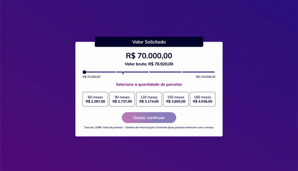
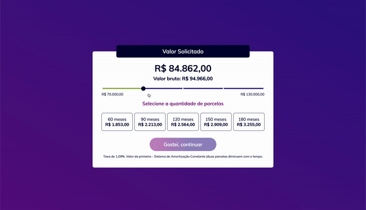

# Ultimate Pontte
> Coding Challenge for Front-End position at [@pontte](https://github.com/pontte) 💸


Developed with ❤ and [React](https://reactjs.org/), [Redux](https://react-redux.js.org/) and [Redux Saga](https://redux-saga.js.org/), *Saga for the first time!* and [JSS](https://cssinjs.org/react-jss).

## 👩🏻‍💻 Coding Challenge

Instructions for coding challenge [here](https://github.com/pontte/frontend-challenge).

### Result expected


### Result received



It was only developed to work correctly in browser Chromium's base like Google Chrome and Microsoft Edge ❤

### Bônus result 🎉



## 📁 Project basics

### Structure

The project has the following structure.

```sh
src
│
└── components
│    │
│    └── Amount
│    │
│    └── Card
│    │
│    └── Typography
│
└── pages
│    │
│    └── Simulator
│
└── styles
│    │
│    └── theme
│        │
│        └── standard
│
└── store
    │
    └── simulator
    │
    └── user
```

### Build

Libraries and/or tools as [dotenv](https://www.npmjs.com/package/dotenv), [webpack](https://www.npmjs.com/package/webpack), [eslint](https://www.npmjs.com/package/eslint), babel, [eslint-config-airbnb](https://www.npmjs.com/package/eslint-config-airbnb) and [babel-preset-airbnb](https://www.npmjs.com/package/babel-preset-airbnb) was used in development.

## 🔨 Usage

### Clone

```sh
git clone git@github.com:keitoliveira/ultimate-pontte.git
cd ultimate-pontte
npm install
```

### Install dependencies

```sh
npm install
```

### Run in developer mode

```sh
npm start
```

### Run for production

```sh
npm run build
```
